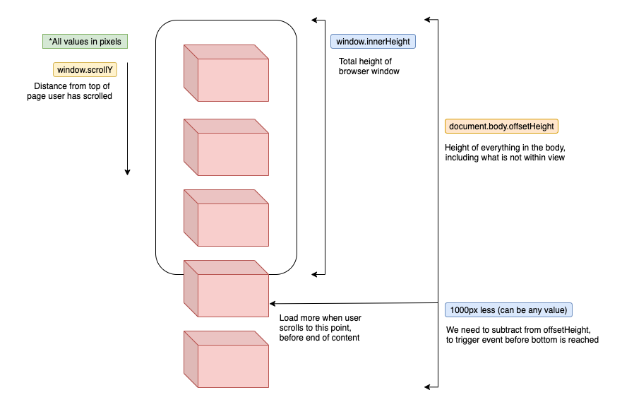

# Infinity Scroll
Show how to implement infinite scrolling functionality

## Important Values
- `window.innerHeight` - Total height of browser window
- `window.scrollY` - Distance from top of page user has scrolled
- `document.body.offsetHeight` - Height of everything in the body, including what is not within view

## References
- Loader https://loading.io/
- Images https://unsplash.com/
- HTML DOM Events https://www.w3schools.com/jsref/dom_obj_event.asp
